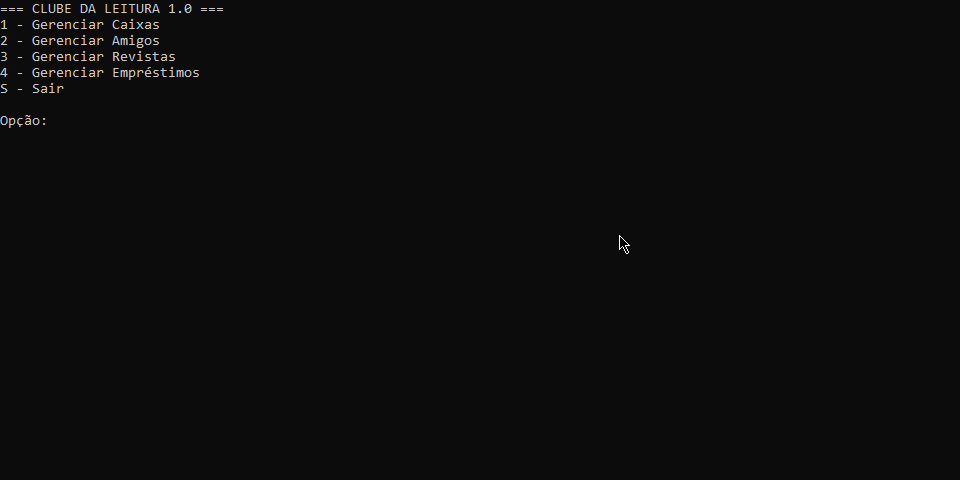

# 📚 Clube da Leitura


Sistema de console desenvolvido para organizar um clube de leitura, permitindo o controle total sobre o armazenamento de revistas, cadastro de membros e gestão de empréstimos com datas de devolução automatizadas.



---

## 🎯 Funcionalidades Principal

O sistema oferece operações completas (CRUD) para manter a organização do clube:

* **📦 Gestão de Caixas**: Organização física por cor e etiqueta, com definição de prazo de empréstimo customizado por caixa.
* **👥 Gestão de Amigos**: Cadastro de membros com informações de contato e responsável (ideal para clubes infantis/juvenis).
* **📖 Controle de Acervo**: Registro de revistas vinculadas a caixas específicas para facilitar a localização.
* **🤝 Sistema de Empréstimos**: Registro de histórico com cálculo automático de devolução e status de disponibilidade da revista.

---

## 🛠️ Tecnologias e Arquitetura

| Recurso | Tecnologia |
| :--- | :--- |
| **Linguagem** | C# |
| **Ambiente** | .NET 10 |
| **Paradigma** | Orientação a Objetos (POO) |
| **Arquitetura** | Camadas (Domain, Presentation, Infrastructure) |

---

## 📖 Como Executar
1. Certifique-se de ter o [.NET SDK](https://dotnet.microsoft.com/download) instalado.
2. Clone o repositório:
   ```bash
   git clone [https://github.com/Dayua-Santana/JogoTermo](https://github.com/Dayua-Santana/JogoTermo)
3. Execute o código utilizando o comando:
    ```bash 
    dotnet run progam.cs
---

## 📁 Organização do Código

A estrutura do projeto foi pensada seguindo o princípio da responsabilidade única:

```bash
ConsoleApp/
 ┣ 📂 Dominio          # Entidades principais e lógica de negócio
 ┣ 📂 Apresentacao     # Interface de usuário (menus e inputs)
 ┣ 📂 Infraestrutura    # Repositórios para armazenamento em memória
 ┗ 📜 Program.cs       # Ponto de entrada (Bootstrap) da aplicação
